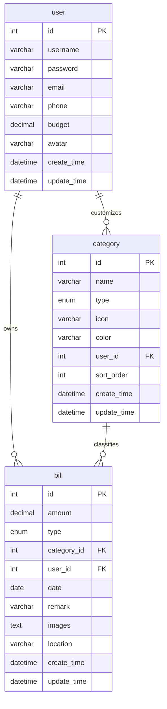

# 数据库设计与统计逻辑

## 1. 数据库定位

数据库名为 `account_dashboard`，使用 `utf8mb4` 编码，主要服务于个人记账看板的三类核心数据：

- 用户：谁在使用系统。
- 分类：账单属于哪一类收入或支出。
- 账单：每一笔收入或支出的明细。

核心脚本：

```text
src/main/resources/sql/schema.sql
```

## 2. 表关系



## 3. 用户表 `user`

用途：保存登录账号、联系方式、月度预算和头像。

| 字段 | 类型 | 说明 |
| --- | --- | --- |
| `id` | `INT` | 主键，自增 |
| `username` | `VARCHAR(50)` | 用户名，唯一 |
| `password` | `VARCHAR(255)` | MD5 后的密码 |
| `email` | `VARCHAR(100)` | 邮箱 |
| `phone` | `VARCHAR(20)` | 手机号 |
| `budget` | `DECIMAL(10,2)` | 月度预算 |
| `avatar` | `VARCHAR(255)` | 头像地址 |
| `create_time` | `DATETIME` | 创建时间 |
| `update_time` | `DATETIME` | 更新时间 |

索引：

- `idx_username`：用于登录时按用户名查找。
- `idx_email`：用于邮箱查重和管理查询。

业务逻辑：

- 登录时通过 `UserMapper.findByUsername` 查用户。
- 注册时通过 `checkUsernameExists` 防止重名。
- 预算提醒使用 `budget` 和当月支出计算。

## 4. 分类表 `category`

用途：保存收入分类和支出分类。

| 字段 | 类型 | 说明 |
| --- | --- | --- |
| `id` | `INT` | 主键，自增 |
| `name` | `VARCHAR(50)` | 分类名称，如餐饮、购物、工资 |
| `type` | `ENUM('income','expense')` | 分类类型，收入或支出 |
| `icon` | `VARCHAR(50)` | 图标标识 |
| `color` | `VARCHAR(20)` | 图表颜色 |
| `user_id` | `INT` | 为空表示系统分类，不为空表示用户自定义分类 |
| `sort_order` | `INT` | 排序值 |
| `create_time` | `DATETIME` | 创建时间 |
| `update_time` | `DATETIME` | 更新时间 |

外键：

```sql
FOREIGN KEY (`user_id`) REFERENCES `user`(`id`) ON DELETE CASCADE
```

业务逻辑：

- 系统分类 `user_id IS NULL`，所有用户都可见。
- 用户分类 `user_id = 当前用户 ID`，只对当前用户可见。
- 查询分类时使用 `findSystemAndUserCategories` 合并系统分类和个人分类。
- 图表颜色来自 `color` 字段。

## 5. 账单表 `bill`

用途：保存每一笔收入或支出。

| 字段 | 类型 | 说明 |
| --- | --- | --- |
| `id` | `INT` | 主键，自增 |
| `amount` | `DECIMAL(10,2)` | 金额 |
| `type` | `ENUM('income','expense')` | 收入或支出 |
| `category_id` | `INT` | 分类 ID |
| `user_id` | `INT` | 所属用户 ID |
| `date` | `DATE` | 账单日期 |
| `remark` | `VARCHAR(500)` | 备注 |
| `images` | `TEXT` | 图片 JSON，预留给票据/OCR |
| `location` | `VARCHAR(255)` | 地点，预留字段 |
| `create_time` | `DATETIME` | 创建时间 |
| `update_time` | `DATETIME` | 更新时间 |

外键：

```sql
FOREIGN KEY (`user_id`) REFERENCES `user`(`id`) ON DELETE CASCADE
FOREIGN KEY (`category_id`) REFERENCES `category`(`id`) ON DELETE RESTRICT
```

设计含义：

- 删除用户时，其账单一起删除。
- 分类被账单引用时不允许直接删除，防止历史账单失去分类。

索引：

- `idx_user_id`：按用户查账单。
- `idx_category_id`：按分类统计。
- `idx_date`：按日期筛选和按月统计。
- `idx_type`：按收入/支出筛选。

## 6. 账单查询逻辑

`BillMapper.findByQuery` 支持以下筛选：

- 用户 ID：保证用户只能看到自己的账单。
- 类型：收入或支出。
- 分类 ID：查询某一分类。
- 开始日期和结束日期：时间范围筛选。
- 关键词：匹配备注或分类名称。
- 分页：`LIMIT pageSize OFFSET offset`。

排序：

```sql
ORDER BY b.date DESC, b.create_time DESC
```

含义：优先显示最近日期，同一天内显示最新创建的记录。

## 7. 统计 SQL 逻辑

### 月度总额

Mapper 方法：

```text
getTotalByMonth
```

SQL 逻辑：

```sql
SELECT COALESCE(SUM(amount), 0)
FROM bill
WHERE user_id = ?
AND DATE_FORMAT(date, '%Y-%m') = ?
AND type = ?
```

用途：

- 仪表板本月收入。
- 仪表板本月支出。
- 本月结余 = 收入 - 支出。

### 分类占比

Mapper 方法：

```text
getCategoryStatistics
```

SQL 逻辑：

```sql
SELECT c.id, c.name, c.icon, c.color, SUM(b.amount)
FROM category c
LEFT JOIN bill b ON c.id = b.category_id
WHERE c.type = ?
GROUP BY c.id, c.name, c.icon, c.color
HAVING amount > 0
ORDER BY amount DESC
```

用途：

- 支出分类占比饼图。
- 分类排行柱状图。
- 智能建议中的“最高分类”。

说明：

- SQL 先按分类求和。
- Service 层再计算百分比。
- `HAVING amount > 0` 会过滤没有账单的分类，避免图表出现无意义项。

### 月度趋势

Mapper 方法：

```text
getMonthlyStatistics
```

SQL 逻辑：

```sql
SELECT DATE_FORMAT(date, '%Y-%m') AS month,
       SUM(CASE WHEN type = 'income' THEN amount ELSE 0 END) AS income,
       SUM(CASE WHEN type = 'expense' THEN amount ELSE 0 END) AS expense,
       income - expense AS balance
FROM bill
WHERE user_id = ?
AND DATE_FORMAT(date, '%Y') = ?
GROUP BY DATE_FORMAT(date, '%Y-%m')
ORDER BY month ASC
```

用途：

- 月度收支趋势折线图。
- 月度收支对比柱状图。
- 年度结余智能分析。

前端会把没有数据的月份补成 0，保证全年 12 个月图表完整。

## 8. 预算提醒逻辑

数据来源：

- 用户预算：`user.budget`
- 当月支出：`bill` 表中当前用户、当前月份、`type='expense'` 的金额合计

判断方式：

```text
预算使用率 = 当月支出 / 月度预算 * 100
是否超支 = 当月支出 > 月度预算
```

页面展示：

- 仪表板预算使用率卡片。
- 超支时显示预算提醒。
- 智能建议根据预算使用率生成提醒文案。

## 9. Excel 导出数据来源

导出接口：

```text
GET /api/statistics/export?startDate=YYYY-MM-DD&endDate=YYYY-MM-DD
```

数据来源：

- `BillService.exportBills`
- 根据用户 ID 和时间范围查询 `bill`
- 同时关联 `category` 展示分类名称

生成方式：

- 后端使用 Apache POI 生成 `.xlsx`
- 前端以 `blob` 方式下载

## 10. 初始化数据

`schema.sql` 包含：

- 系统分类：餐饮、购物、交通、娱乐、医疗、学习、住房、工资、奖金、投资、兼职等。
- 测试用户：`testuser / 123456`、`admin / admin123`。
- 2025 和 2026 年测试账单数据。

如果旧库里已有英文分类，可执行：

```text
src/main/resources/sql/localize_demo_data.sql
```

该脚本会把英文分类和英文备注更新为中文，保证界面展示更统一。
